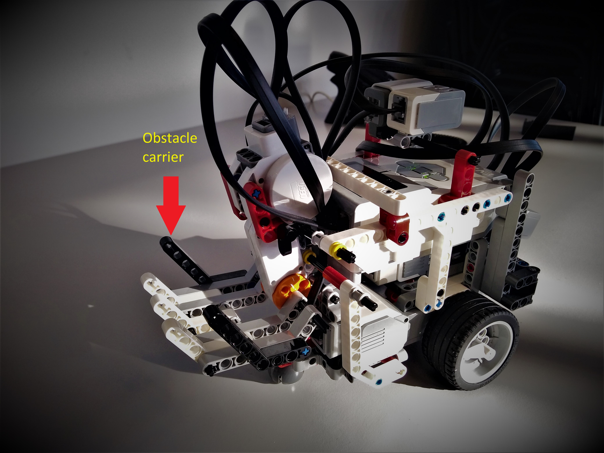
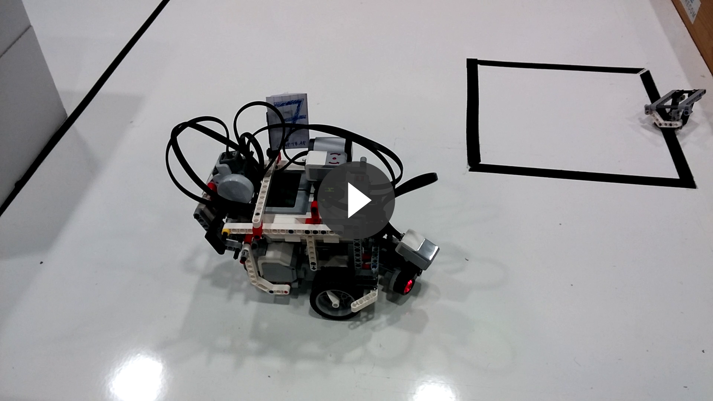
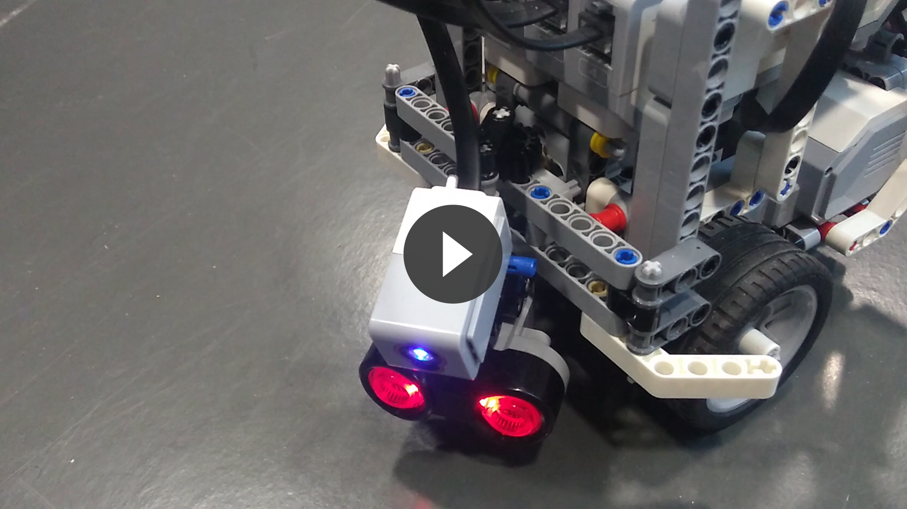
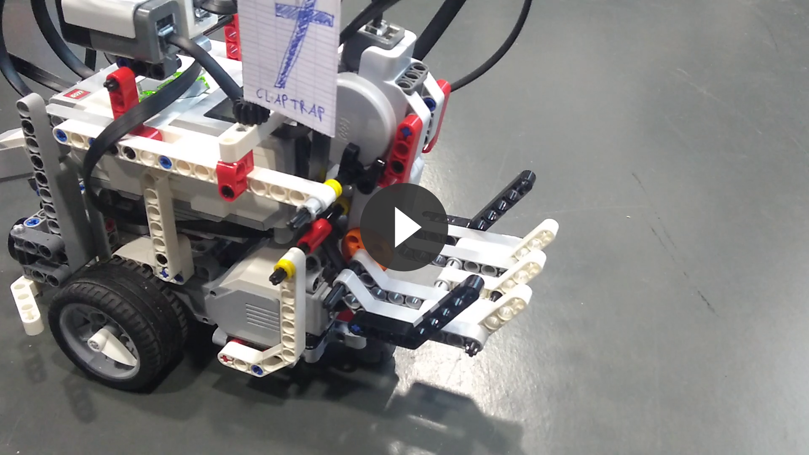

# Claptrap, a room mapping robot

## <a name="contents"></a>Table of contents

1. [Presentation](#presentation)
2. [Links](#links)
3. [Source code and instructions](#instructions)
4. [Claptrap specifications](#specs)
5. [Code architecture](#architecture)
6. [Algorithms](#algorithms)
7. [Work division](#division)
8. [Videos and Pictures](#videos)

## <a name="presentation"></a>Presentation
_Claptrap_ is a robot based on the LEGO MINDSTORMS EV3, whose purpose is to map a previously unknown room. It has been designed by Nathan Biette, Erwan Culerier and Olivier Roques for the OS fall course 2017 at [EURECOM](http://www.eurecom.fr/en).

[_Back to top_](#contents)

## <a name="links"></a>Links

#### General information
* [Project website](http://soc.eurecom.fr/OS/projects_fall2017.html)
* [Project repository](https://gitlab.eurecom.fr/ludovic.apvrille/OS_Robot_Project_Fall2017)
* [Claptrap repository](https://github.com/ojroques/OSproject-Claptrap)
* [Robot set-up](http://www.ev3dev.org/docs/getting-started/)

#### Documentation
* [EV3DEV Hardware Documentation](http://docs.ev3dev.org/projects/lego-linux-drivers/en/ev3dev-jessie/index.html)
* [EV3DEV C Library](http://in4lio.github.io/ev3dev-c/index.html)

[_Back to top_](#contents)

## <a name="instructions"></a>Source code and instructions

Source code is available on [our repository](https://github.com/ojroques/OSproject-Claptrap). Follow these steps to run our algorithm on your Lego Mindstorms EV3:

1. [Set-up the robot](http://www.ev3dev.org/docs/getting-started/) and connect to it via ssh.
2. Update the robot with the latest packages:
``` Shell
sudo apt-get update && sudo apt-get upgrade
```
3. Install extra packages you will need for the project:
``` Shell
sudo apt-get install gcc make libbluetooth-dev
```
4. Install the development environment on the robot:
``` Shell
GIT_SSL_NO_VERIFY=true git clone https://github.com/in4lio/ev3dev-c.git
cd ~/ev3dev-c/source/ev3
make
sudo make install
```
5. Clone our repository on the robot and compile the source:
``` Shell
cd ~
git clone https://github.com/ojroques/OSproject-Claptrap.git
cd OSproject-Claptrap/src/
make main
```
6. Install the server **on a computer**:
``` Shell
git clone https://gitlab.eurecom.fr/ludovic.apvrille/OS_Robot_Project_Fall2017.git
cd OS_Robot_Project_Fall2017/server
make server
```
7. On the robot, change `SERV_ADDR` in `src/client.h` with your server bluetooth adress.
8. On your server, create a file with 14 lines. Each line of this file must correspond to a robot following this format:
```
1 BLUETOOTH_ADDR ROBOT_NAME
```
You can copy-paste this example in a file called `claptrap` to use only Claptrap as robot (the team ID of Claptrap is 7, you can change it in `config.h`):
```
1 00:00:00:00:00:00 Team01
1 00:00:00:00:00:00 Team02
1 00:00:00:00:00:00 Team03
1 00:00:00:00:00:00 Team04
1 00:00:00:00:00:00 Team05
1 00:00:00:00:00:00 Team06
1 a0:e6:f8:dc:96:79 Claptrap  <-- Use your own bluetooth address here
1 00:00:00:00:00:00 Team07
1 00:00:00:00:00:00 Team08
1 00:00:00:00:00:00 Team09
1 00:00:00:00:00:00 Team10
1 00:00:00:00:00:00 Team11
1 00:00:00:00:00:00 Team12
1 00:00:00:00:00:00 Team13
```
9. Launch the server with the previously created file:
``` Shell
./server claptrap
```
10. You can now run the program on your robot:
``` Shell
cd OSproject-Claptrap/src/
make run
```

[_Back to top_](#contents)

## <a name="specs"></a>Claptrap specifications

#### Sensors
Claptrap uses 4 sensors:
* [Ultrasonic Sensor](https://shop.lego.com/en-CA/EV3-Ultrasonic-Sensor-45504)
* [Color Sensor](https://shop.lego.com/en-CA/EV3-Color-Sensor-45506)
* [Gyro Sensor](https://shop.lego.com/en-CA/EV3-Color-Sensor-45506)
* [Compass Sensor](http://modernroboticsinc.com/hitechnic-nxt-compass-sensor)

#### Tachos
Claptrap uses 4 tachos:
* Two [large tachos](https://shop.lego.com/en-CA/EV3-Large-Servo-Motor-45502) for both wheels
* One large tacho in its back for the obstacle carrier
* One [medium tacho](https://shop.lego.com/en-CA/EV3-Medium-Servo-Motor-45503) to control the rotation of the ultrasonic sensor

[_Back to top_](#contents)

## <a name="architecture"></a>Code architecture

The repository contains 3 folders:
- **docs** : website content
- **src** : the project source code
- **tests** : general tests for sensors and tachos

#### _src_ structure
The source code is split into 8 parts:
- **main.c** and **main.h** : the main algorithm
- **client.c** and **client.h** : client-server communications
- **config.c** and **config.h** : Claptrap initialization (tachos, sensors, network, image) and uninitialization
- **image.c** and **image.h** : map functions
- **position.c** and **position.h** : position thread and functions
- **sensors.c** and **sensors.h** : to use the sensors
- **tachos.c** and **tachos.h** : to control the tachos
- **const.h** : general constants

[_Back to top_](#contents)

## <a name="algorithms"></a>Algorithms

Claptrap is initialized with a map of arbitrary size filled with 0 (unexplored) and a starting position, as well as a timer (4 minutes).

#### The exploration algorithm
An infinite loop is started. There are two parts to this loop:
1. First, the center of the largest unexplored area is given to Claptrap, which then tries to go there. Once arrived or if it encounters an obstacle, it stops and go to the next step. This part aims to maximize the surface explored.
2. The area exploration procedure is then executed 4 times.

###### Area exploration
This second part is split into 5 sections:
1. **ANALYSE** :
    - Claptrap faces one direction (North for instance)
    - If it detects an object at less than 25cm, it calls the procedure `obstacle_type` detailed below
    - If there is in fact an unmovable object, we update the map accordingly
    - In any cases, we save the sonar value for the current direction (North here)
    - Claptrap rotate by 90 deg.
    - We start over until each direction has been analyzed
2. **DECISION** :
    - Claptrap selects the direction with largest leeway and greater than 15cm (to allow it to move without bumping into obstacles)
    - If this direction would result in a loop (Claptrap goes back and forth), it is ignored
    - The chosen direction is saved (if there is one)
3. **MOVEMENT** :
    - Claptrap turns to face the chosen direction
    - It goes forward until an obstacle is detected
4. **LOOPING AND STOPPING CONDITIONS**
    - Claptrap restarts at **analyse**
    - Exploration is stopped when time is up or Claptrap is stuck (no direction available)
5. **MAPPING**
    - The map is sent to the server: 0 indicates free area, 1 indicates obstacles

###### *OBSTACLE_TYPE* procedure

This function returns the type of obstacle Claptrap is currently facing:
1. Claptrap moves closer to the object (typically at 3cm from the object to make color detection possible and reliable)
2. The color is analyzed: red indicates a movable obstacle
3. Claptrap moves backward to its previous position
4. An integer is returned indicating the obstacle type or if there is none

#### Position thread
In parallel of the main algorithm, a thread updates Claptrap position. This position is then sent to the server every 1.5s.

[_Back to top_](#contents)

## <a name="division"></a>Work division

You can check our repository activity [here](https://github.com/ojroques/OSproject-Claptrap/pulse/monthly).

#### Olivier Roques
* Main algorithm: procedures for room exploration and mapping
* Client / Server communications
* Map and image: initialization, manipulation and transmission
* Website
* Integration
* Robot configuration in `config.c` regarding the server and the image

#### Nathan Biette
* Robot architecture: building the LEGO robot
* Sensors: tests, initialization, getters
* Robot movements: release of an obstacle, controlling the tacho to rotate the head, rotation of the robot using the gyro, translation calibration, updating the robot position
* Robot configuration in `config.c` regarding the sensors

#### Erwan Culerier
* Robot movements: basic rotation and translation
* Position: calculation, thread, obstacle positioning
* Map and image: update map after scan or movement
* Robot configuration in `config.c` regarding the tachos
* Images and videos

[_Back to top_](#contents)

## <a name="videos"></a>Videos and Pictures

#### Pictures

###### Claptrap


###### The movable ultrasonic sensor


###### The obstacle carrier


#### Videos

Click the pictures to access the videos.

###### Exploration
[](https://drive.google.com/open?id=1-tx63NhBDDRA2mw_ZKFJzJqHn8uxgZY8)

###### Sonar scan
[](https://drive.google.com/open?id=1p0SSvEVGU6Y8ZADcCbOXx9lE1dRZOtQf)

###### Drop obstacle
[](https://drive.google.com/open?id=1xmphxhF1rfvHbXHMVS1Uy_wXY_cWWB8V)

[_Back to top_](#contents)
